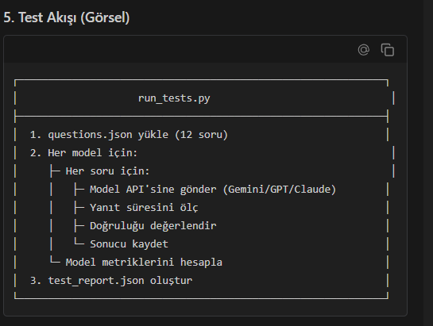

# 🧪 CodeAlchemist

**CodeAlchemist**, yapay zeka destekli kod geliştirme süreçlerini optimize eden, çoklu LLM (Büyük Dil Modeli) entegrasyonuna sahip yeni nesil bir kod asistanı platformudur.

Google Gemini, OpenAI GPT-4o ve Anthropic Claude 3.5 Sonnet modellerini tek bir çatı altında birleştirerek, geliştiricilere **"Model Alchemy"** (Model Simyası) deneyimi sunar: Kodunuzu farklı modellerin merceğinden geçirerek en doğru, en optimize ve en güvenli sonuca ulaşmanızı sağlar.



---

## 🎯 Temel Özellikler

### 1. ⚗️ Model Simyası (Alchemy) & Karşılaştırma
Tek bir modele bağlı kalmayın. CodeAlchemist, sorunuzu aynı anda birden fazla modele (Gemini, GPT-4o, Claude) yönlendirerek yanıtları yan yana karşılaştırmanıza olanak tanır.
- **Hakem Modeli**: Farklı model çıktılarını analiz ederek en iyi parçaları birleştirir ve "Altın Çözüm"ü sunar.
- **A/B Testi**: Kendi kullanım senaryonuzda hangi modelin daha başarılı olduğunu anlık olarak görün.

### 2. 🛡️ Akıllı Post-Processing Katmanı
Ham LLM çıktıları bazen hatalı veya eksik olabilir. CodeAlchemist'in özel ara katmanı:
- Markdown formatını düzeltir.
- Eksik parantezleri ve sözdizimi hatalarını otomatik tamamlar.
- Kod bloklarını IDE uyumlu hale getirir.

### 3. 👥 Sosyal Kodlama Ağı
Yalnız kodlamayın. CodeAlchemist, geliştiriciler için bir sosyal platform sunar:
- **Community Feed**: Sorularınızı ve çözümlerinizi toplulukla paylaşın.
- **Etkileşim**: Diğer geliştiricilerin çözümlerini beğenin, yorum yapın ve fork'layın.

### 4. ⚡ Gelişmiş Teknik Altyapı
- **Streaming Response**: Modellerden gelen yanıtları kelime kelime anlık olarak izleyin.
- **Güvenli Auth**: JWT tabanlı güvenli kimlik doğrulama.
- **Karanlık/Aydınlık Mod**: Göz yormayan, geliştirici dostu arayüz temaları.

---

## 📸 Uygulama Turu

### Giriş ve Güvenlik
Kullanıcı dostu arayüz ve güvenli giriş sistemi.


### Model Karşılaştırma (Alchemy Modu)
Aynı kod probleminin farklı yapay zeka modelleri tarafından nasıl çözüldüğünü yan yana inceleyin.


### Topluluk Akışı
Global geliştirici topluluğunun paylaşımlarını keşfedin.


---

## 📂 Proje Mimarisi

CodeAlchemist, modern ve ölçeklenebilir bir mimari üzerine inşa edilmiştir:

```
CodeAlchemist/
├── client/                     # Frontend (React + Vite + TailwindCSS)
│   ├── src/
│   │   ├── components/         # Yeniden kullanılabilir UI bileşenleri
│   │   ├── services/           # API istekleri ve servis katmanı
│   │   └── context/            # Global state yönetimi (Auth, Theme)
│   └── ...
│
├── server/                     # Backend (Python Flask)
│   ├── app.py                  # Ana API Gateway ve Controller
│   ├── models.py               # SQLAlchemy Veritabanı Modelleri
│   ├── testbed/                # 🧪 LLM Performans Test Ortamı (Önemli!)
│   │   ├── run_tests.py        # Test çalıştırma motoru
│   │   └── questions.json      # Benchmark soru seti
│   └── ...
│
└── docs/                       # Proje dokümantasyonu ve görseller
```

---

## 🧪 TestBed: Bilimsel Performans Analizi

CodeAlchemist, sadece modelleri kullanmakla kalmaz, onları sürekli olarak test eder ve kıyaslar. Proje içerisinde gömülü gelen **TestBed** modülü, modellerin kod üretim kalitesini objektif metriklerle ölçer.

### Test Metodolojisi
TestBed, aşağıdaki 4 ana kategoride modelleri zorlar:

1.  **Syntax (Sözdizimi)**: Dil kurallarına uyum.
2.  **Logic (Mantık)**: Algoritmik doğruluk ve edge-case yönetimi.
3.  **Algorithm**: Karmaşık problem çözme yeteneği.
4.  **Optimization**: Kod verimliliği ve kaynak kullanımı.

### Veri Kaynakları
- **Statik Benchmarklar**: `questions.json` içindeki standart sorular.
- **Dinamik Veri**: Stack Overflow API entegrasyonu ile gerçek dünyadan canlı sorular çekilerek test edilir.

### Sonuçlar (Örnek Rapor)
Yapılan son testlerde elde edilen çarpıcı bulgular:
*   **Gemini 2.5 Flash**: Hız ve basit kod tamamlamada lider (%85 başarı).
*   **Claude 3.5 Sonnet**: Karmaşık mimari kararlarda ve dokümantasyonda en iyisi.
*   **Post-Processing Etkisi**: CodeAlchemist'in düzeltme katmanı, model hatalarını **%40 oranında** azaltmıştır.

> *Detaylı test raporları ve metrikler için `server/testbed/README.md` dosyasını inceleyebilirsiniz.*

---

## 🛠️ Kurulum ve Çalıştırma

Geliştirme ortamını kurmak için aşağıdaki adımları izleyin:

### 1. Gereksinimler
*   Node.js 18+
*   Python 3.9+
*   Git

### 2. Projeyi Klonlayın
```bash
git clone https://github.com/Dilakemer/code_alchemist.git
cd code_alchemist
```

### 3. Backend Kurulumu
```bash
cd server
python -m venv venv
# Windows için:
venv\Scripts\activate
# Mac/Linux için: source venv/bin/activate

pip install -r requirements.txt
```

`.env` dosyanızı oluşturun ve API anahtarlarınızı ekleyin (Bknz: `.env.example`).

### 4. Frontend Kurulumu
```bash
cd ../client
npm install
```

### 5. Uygulamayı Başlatın

**Terminal 1 (Backend):**
```bash
cd server
python app.py
```

**Terminal 2 (Frontend):**
```bash
cd client
npm run dev
```

Uygulama `http://localhost:5173` adresinde çalışacaktır.

---

## 👥 Ekip

- **Dila KEMER** - *Lead Developer & AI Architect*
- **Azra Nur AKBABA** - *Full-Stack Engineer (Frontend & Backend) | UI/UX DesigneEngineer & UI/UX Designer*

---

## 📄 Lisans

Bu proje akademik ve eğitim amaçlı geliştirilmiştir. Tüm hakları saklıdır.
